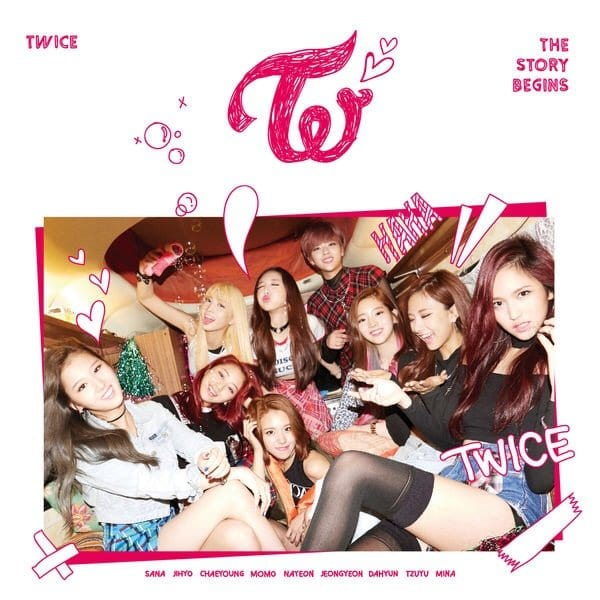

# mmhe.github.io

**TWICE** 

Girl Group under JYPEntertainment. Debuted through a survival show called "Sixteen" 

Members: 

Im Nayeon 

Yoo Jeongyeon 

Hirai Momo 

Minatozaki Sana 

Park Jihyo 

Myoui Mina 

Kim Dahyun 

Son Chaeyoung 

Chou Tzuyu 

Debut date: October 20, 2015 

Debut Album: The Story Begins (2015) 

Latest album: Formula of Love O+T=<3 (2021) 

**Discography (Korean)** 

**The Story Begins (Mini Album)** 

<iframe width="560" height="315" src="https://www.youtube.com/embed/0rtV5esQT6I" title="YouTube video player" frameborder="0" allow="accelerometer; autoplay; clipboard-write; encrypted-media; gyroscope; picture-in-picture" allowfullscreen></iframe>

Released: October 20, 2015 
Album Songs: Like Ohh-Ahh (OOH-AHH하게), Do it Again, Going Crazy, Truth, Candy Boy, and Like a Fool

Spotifly Playlist: 

<iframe style="border-radius:12px" src="https://open.spotify.com/embed/album/72WWZVAx6GtSbEeGESwDLo?utm_source=generator" width="100%" height="380" frameBorder="0" allowfullscreen="" allow="autoplay; clipboard-write; encrypted-media; fullscreen; picture-in-picture"></iframe>

**Page 2 (Mini Album)** 

<iframe width="560" height="315" src="https://www.youtube.com/embed/c7rCyll5AeY" title="YouTube video player" frameborder="0" allow="accelerometer; autoplay; clipboard-write; encrypted-media; gyroscope; picture-in-picture" allowfullscreen></iframe>

Released: April 25, 2016
Album Songs: Cheer Up, Precious Love, 
